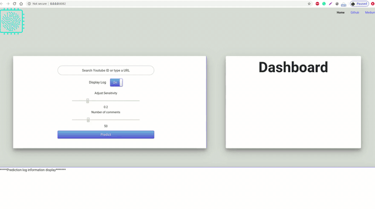

[](https://www.python.org/downloads/release/python-376/)
[](https://github.com/tensorflow/tensorflow/releases)
[](https://github.com/kumar-shridhar/APOLLO-1/blob/master/LICENSE)

                                                                   

# APOLLO-1: Online Toxicity Detection

**APOLLO-1** is one of the many APOLLO projects to be launched in future. This project is aimed at developing an application that detects **toxicity in an online conversation**.

 

---------------------------------------------------------------------------------------------------------

## How to run

1. Clone the repo: ``` git clone https://github.com/kumar-shridhar/Online-Toxicity-Detection.git``` 
2. Make sure you have anaconda installed. If not, check [here](https://docs.anaconda.com/anaconda/install/). 
3. Install all the requirements using conda yaml: ```conda env create -f environment_{os}.yml``` where ```{os}``` can be ```Windows``` or ```Linux```.
4. Download saved model from [here](https://drive.google.com/file/d/1RNd4L_zGVrFF_Cl-6KfoHIInMO-5A0e3/view?usp=sharing)
5. Unzip the model and save in ```Online-Toxicity-Detection/apollo/inference``` folder.
6. Run command: 
    * ``` cd Online-Toxicity-Detection```
    * ``` python apollo/Frontend/app.py```
7. Go to ```localhost:8082``` and provide the YouTube URL, and set the ```sensitivity``` and ```number of comments```. The results will be displayed in a chart form. 
8. You can export the ```.csv``` file of the final results by clicking on ```export results```.

---------------------------------------------------------------------------------------------------------

## References

* [Egbertbouman](https://github.com/egbertbouman/youtube-comment-downloader)
* [HuggingFace](https://github.com/huggingface/transformers)
* [Xhlulu](https://www.kaggle.com/xhlulu/jigsaw-tpu-xlm-roberta)

---------------------------------------------------------------------------------------------------------

### Contact

Feel free to contact the authors in case of any issues. 

[Naveed Akram](https://github.com/n-akram), [Ritu Yadav](https://github.com/RituYadav92), [Venkatesh Iyer](https://github.com/venkyiyer)
[Sadique Adnan Siddiqui](https://github.com/sadique-adnan), [Ashutosh Mishra](https://github.com/ashutoshmishra1014), [Kumar Shridhar](https://kumar-shridhar.github.io/)
